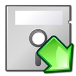
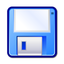

# Руководство пользователя

## Главное окно

В левой части выводится список файлов-образов на диске, в правой &ndash; открытый образ. Вкладка &laquo;Файлы&raquo; показывает файлы, &laquo;Информация&raquo; &ndash; сводную информацию о файловой системе.  

## Основные операции

Левая панель:

*  &ndash; перейди вверх на один уровень;
*  &ndash; открыть директорию;
*  &ndash; анализ выбранного файла;
*  &ndash; открыть образ. Операцию также можно выполнить двойным кликом мышью.

Правая панель:

*  &ndash; информация о выбранном файле;
*  &ndash; просмотр файла. Операцию также можно выполнить двойным кликом мышью.;
*  &ndash; сохранить файл на диск;
*  &ndash; Экспорт диска целиком.

Просмотр файла:

В окне просмотра файла выбирается формат (Текст/двоичный) и кодировка.

Экспорт диска:

При экспорте диска, в зависимости от выбранного формата, даступны следующие операции:

* Замена первых дорожек на дорожки из файла-образца. Пока доступно только для формата DSK.
* Указание метки тома. Доступно для физических форматов. Обратите внимание, что метка тома, указанная в файловой системе (можно посмотреть в окне информации), в общем случае должна совпадать со значением, записанным в заголовках секторов.
* Задать [чередование секторов](https://en.wikipedia.org/wiki/Interleaving_(disk_storage)) для физических форматов.