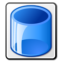

# Руководство пользователя

## Главное окно

В левой части выводится список файлов-образов на диске, в правой &ndash; открытый образ. Вкладка &laquo;Файлы&raquo; показывает файлы, &laquo;Информация&raquo; &ndash; сводную информацию о файловой системе.

Чтобы программа могла правильно обработать образы дисков, необходимо правильно установить их параметры. Во многих случаях это можно сделать автоматически, отметив опцию &laquo;Авто&raquo;, но в случае, когда автоопределение не сработало, отметку можно снять и попробовать задать значения вручную. 

## Основные операции

Левая панель:

*  &ndash; перейди вверх на один уровень;
*  &ndash; открыть директорию;
*  &ndash; анализ выбранного файла;
*  &ndash; открыть образ. Операцию также можно выполнить двойным кликом мышью.
* &laquo;Авто&raquo; &ndash; при открытии образа программа попытается определить параметры автоматически.

Правая панель:
* Блок &laquo;Список файлов&raquo;
    *  &ndash; перейди вверх на один уровень;
    *  &ndash; включение/отключение алфавитной сортировки списка файлов;
    *  &ndash; включение/отключение отображения удаленных файлов.
* Блок &laquo;Чтение и информация&raquo;
    *  &ndash; информация о выбранном файле;
    *  &ndash; просмотр файла. Операцию также можно выполнить двойным кликом мышью.;
    *  &ndash; сохранить файл на диск.
* Блок &laquo;Редактирование&raquo;
    *  &ndash; создание директории;
    *  &ndash; переименование файла, редактирование атрибутов и метаданных;
    *  &ndash; добавление новых файлов;
    *  &ndash; удаление файлов.
* Блок &laquo;Экспорт&raquo;
    *  &ndash; экспорт диска целиком.

Просмотр файла:

В окне просмотра файла выбирается формат (Текст/двоичный/Бейсик) и кодировка.

Экспорт диска:

При экспорте диска, в зависимости от выбранного формата, доступны следующие операции:

* Замена первых дорожек на дорожки из файла-образца. Пока доступно только для формата DSK.
* Указание метки тома. Доступно для физических форматов. Обратите внимание, что метка тома, указанная в файловой системе (можно посмотреть в окне информации), в общем случае должна совпадать со значением, записанным в заголовках секторов.

Переименование файла и редактирование метаданных.

Набор доступных полей для редактирования зависит от файловой системы конкретного диска. На скриншоте выше показаны значения, характерные для Apple DOS 3.3.

С помощью переключателя вверху окна можно изменять формат вводимых числовых данных &ndash; десятичный/шестнадцатеричный.