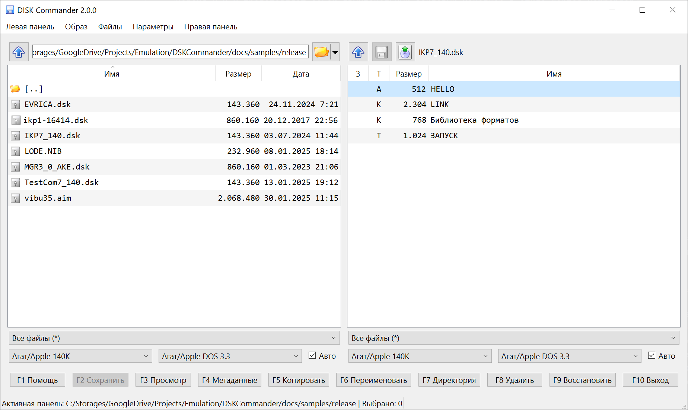
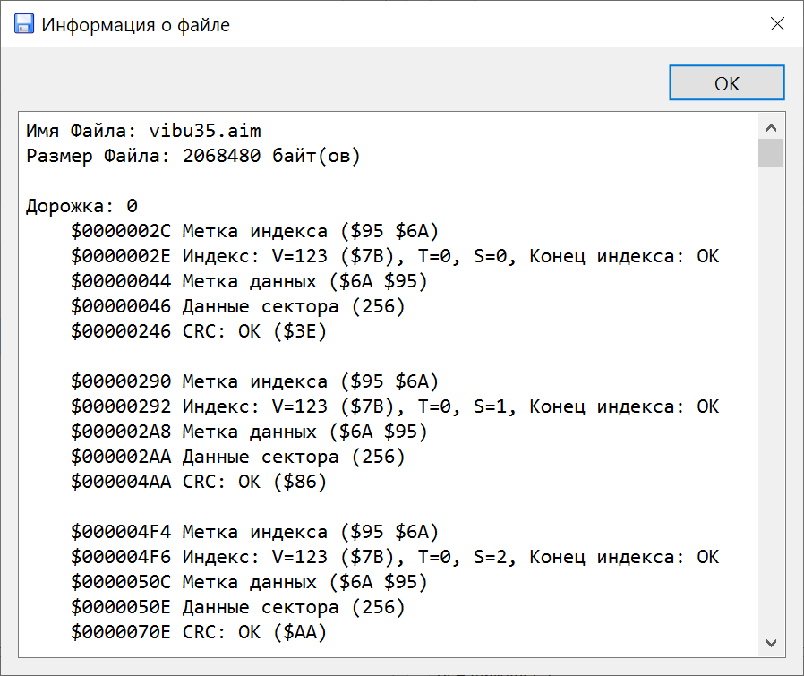
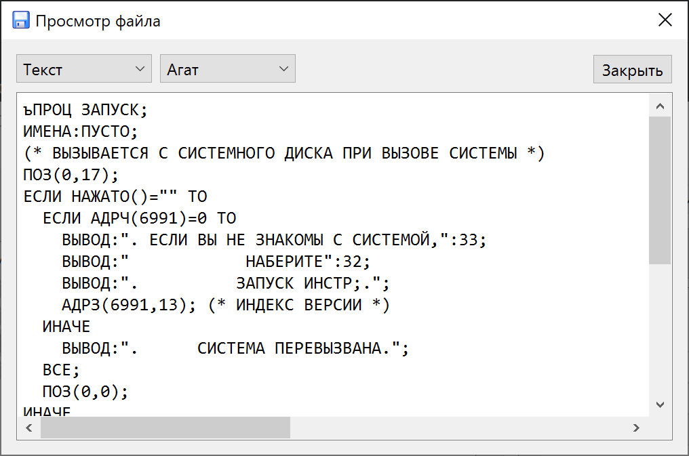
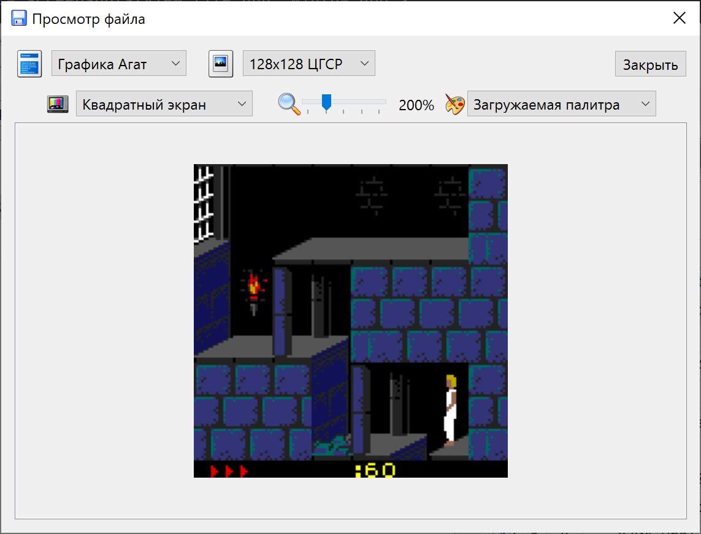
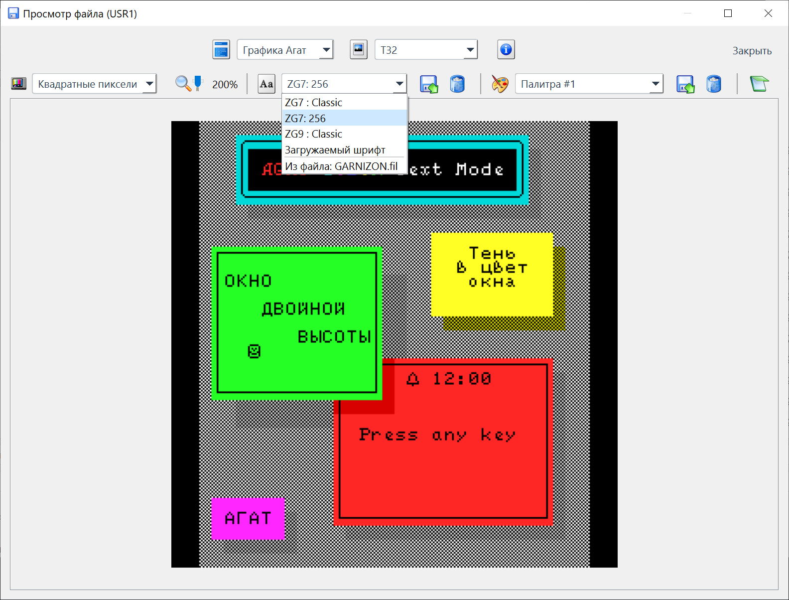
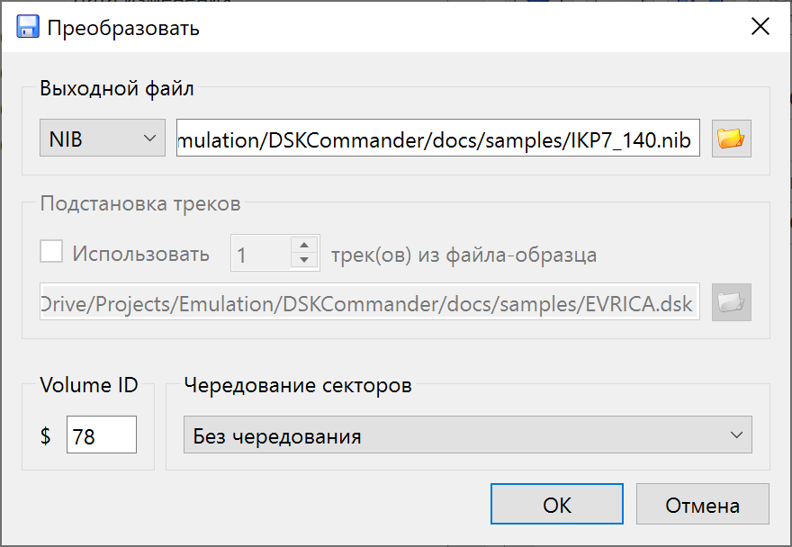
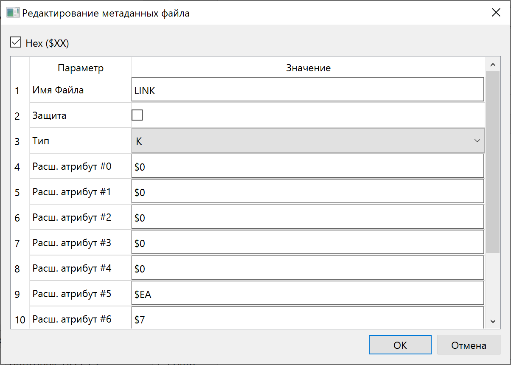

# Руководство пользователя

## Главное окно

Версия 2.x.x представляет собой двухпанельный файловый менеджер в стиле Norton Commander. Левая и правая панели являются равноценными и позволяют одновременно просматривать содержимое диска и файловую систему компьютера, или два разных диска.

**Основные возможности:**
- **Двухпанельный интерфейс** &ndash; каждая панель может независимо работать с образом диска или директорией на компьютере.
- **Групповые файловые операции** &ndash; копирование, перемещение и удаление файлов между панелями.
- **Рекурсивные операции** &ndash; копирование и удаление полных директорий со всем содержимым.
- **Независимая история навигации** &ndash; каждая панель запоминает свою историю переходов.
- **Проверка несохранённых изменений** &ndash; программа предупредит перед закрытием, если образ был изменён, но не сохранён.
- **Корзина для файлов** &ndash; файлы на компьютере перемещаются в корзину вместо окончательного удаления.

Чтобы программа могла правильно обработать образы дисков, необходимо правильно установить их параметры. Во многих случаях это можно сделать автоматически, отметив опцию &laquo;Авто&raquo;, но в случае, когда автоопределение не сработало, отметку можно снять и попробовать задать значения вручную. 

## Основные операции

### Панели (Левая и Правая &ndash; равноценные)

Обе панели имеют одинаковый функционал.

### Клавиатурные сокращения

Программа использует классическую раскладку клавиш файловых менеджеров:

* **Insert** &ndash; выделить/снять выделение текущего файла и перейти к следующему;
* **Стрелки вверх/вниз** &ndash; перемещение курсора без изменения выделения;
* **Backspace** &ndash; перейти вверх на один уровень;
* **Enter** &ndash; открыть файл или директорию;
* **+** (Plus) &ndash; выделить все файлы;
* **-** (Minus) &ndash; снять выделение со всех файлов;
* __*__ (Asterisk) &ndash; инвертировать выделение;
* **Tab** &ndash; переключиться на другую панель;
* **F1** &ndash; вызов окна &laquo;О программе&raquo;;
* **F2** &ndash; сохранить изменённый образ (для DSK);
* **Ctrl-F2** &ndash; экспортировать образ в другой формат;
* **F3** &ndash; просмотр файла;
* **Ctrl-F3** &ndash; просмотр информации о файле внутри образа;
* **F4** &ndash; открыть образ/редактировать метаданные;
* **F5** &ndash; копирование файлов;
* **F6** &ndash; переименование файла;
* **F7** &ndash; создание директории;
* **F8** &ndash; удаление файлов;
* **F10** &ndash; выход из программы.

### Навигация в панелях
*  &ndash; перейти вверх на один уровень;
*  &ndash; выбрать директорию;

### Выбор файлов
* **Insert** &ndash; выделить/снять выделение текущего файла и перейти к следующему;
* **+** (Plus) &ndash; выделить все файлы;
* **-** (Minus) &ndash; снять выделение со всех файлов;
* __*__ (Asterisk) &ndash; инвертировать выделение;

### Операции с файлами
 
* **Сохранение изменений** (F2) &ndash; сохранение изменённого образа (пока только для DSK). Если включено резервное копирование, то старый файл будет сохранён и переименован.

* **Экспорт образа в другой формат** (Ctrl-F2) &ndash; [конвертация открытого образа](#экспорт-диска) в другой формат. 

* **Просмотр** (F3) &ndash; для образов дисков на компьютере &ndash; вывод [информации об образе](#информация-об-образе), для файлов в образах &ndash; [просмотр файлов](#просмотр-файла) в различных форматах.

* **Информация о файле** (Ctrl-F3) &ndash; вывод информации файловой системы о файле внутри образа.

* **Редактирование метаданных** (F4) &ndash; [редактирование служебной информации](#редактирование-метаданных) о файле (возможности зависят от файловой системы).

* **Переименование файла или директории** (F7) &ndash; переименование файлов и директорий.

* **Восстановление файла или директории** (F9) &ndash; восстановление удалённых файлов или директорий, если это возможно. В данный момент доступно для дисков Apple DOS. **Полноценное восстановление возможно только в том случае, если сектора, ранее занятые файлом, не перезаписаны позднее другими файлами!**

### Групповые операции

* **Копирование файлов** (F5) &ndash; скопировать выделённые файлы из активной панели в другую панель. 

* **Перемещение файлов** (F6) &ndash; переместить или переименовать файлы. При перемещении между разными панелями файлы копируются, а затем удаляются из исходной панели.

* **Рекурсивное копирование директорий** &ndash; при копировании директории программа рекурсивно копирует всё её содержимое, сохраняя структуру папок.

* **Удаление** (F8) &ndash; переместить или переименовать файлы. При перемещении между разными панелями файлы копируются, а затем удаляются из исходной панели.
 
* **Рекурсивное удаление директорий** &ndash; удаление директории удаляет все файлы и подпапки внутри неё.

### Форматы файлов при копировании между дисками

При копировании файлов между двумя образами дисков с разными файловыми системами, может появиться диалог выбора формата.

В частности, если файлы копируются из образа Apple DOS на компьютер, будут доступны два формата &ndash; двоичный, когда файл будет сохранён &laquo;как есть&raquo;, и [FIL](https://agatcomp.ru/agat/PCutils/FileType/FIL.shtml) - помимо данных, сохраняется служебная информация.

Также, в обратную сторону, если файл FIL копируется с компьютера в образ Apple DOS, его содержимое будет корректно обработано с учетом служебных данных. 

## Безопасность и резервное копирование

### Проверка несохранённых изменений

Если вы работали с образом диска (добавили, удалили или изменили файлы), но не сохранили результаты, программа предупредит вас перед закрытием:

* Выберите **Экспорт** для сохранения диска;
* Выберите **Закрыть без сохранения**, если хотите отменить все изменения.

### Корзина для файлов на компьютере

При удалении с компьютера, если включена соответствующая настройка, файлы перемещаются в корзину (Recycle Bin на Windows, Trash на macOS/Linux) вместо окончательного удаления. Это позволяет восстановить файлы при случайном удалении.

**Примечание:** Файлы, удалённые с образа диска, удаляются окончательно (в соответствии с файловой системой диска).

### Информация об образе

В окне выводится информация об образе. Состав информации зависит от формата.

### Просмотр файла

В окне просмотра файла выбирается формат (Текст/двоичный/Бейсик и т.д.). Для текстовых форматов также выбирается кодировка, для графических &ndash; дополнительные параметры.

#### Просмотр графических образов экранов Агат

Для выбора доступны: соотношение сторон, масштаб и палитра. Если в файле присутствует заполненный [VR-блок](https://agatcomp.ru/agat/PCutils/EXIF.shtml), тип изображения и палитра будут выбраны автоматически. 

#### Просмотр текстовых образов экранов Агат

Для текстовых форматов доступен выбор типа знакогенератора. Если в файле присутствует заполненный [VR-блок](https://agatcomp.ru/agat/PCutils/EXIF.shtml), знакогенератор будет выбран автоматически.

Для загружаемых знакогенераторов: знакогенератор в формате ZG7 или ZG9 должен лежать вместе с просматриваемым файлом на образе диска или рядом с образом в файловой системе ОС компьютера в формате FIL. Файл FIL должен называться одинаково с именем загружаемого знакогенератора (&laquo;GARNIZON.fil&raquo;). Внутри FIL должен лежать файл с префиксом типа: &laquo;ZG9_GARNIZON&raquo;. 

### Экспорт диска

При экспорте диска, в зависимости от выбранного формата, доступны следующие операции:

* Замена первых дорожек на дорожки из файла-образца. Пока доступно только для формата DSK.
* Указание метки тома. Доступно для физических форматов. Обратите внимание, что метка тома, указанная в файловой системе (можно посмотреть в окне информации), в общем случае должна совпадать со значением, записанным в заголовках секторов.

### Редактирование метаданных.

Набор доступных полей для редактирования зависит от файловой системы конкретного диска. На скриншоте выше показаны значения, характерные для Apple DOS 3.3.

С помощью переключателя вверху окна можно изменять формат вводимых числовых данных &ndash; десятичный/шестнадцатеричный.

