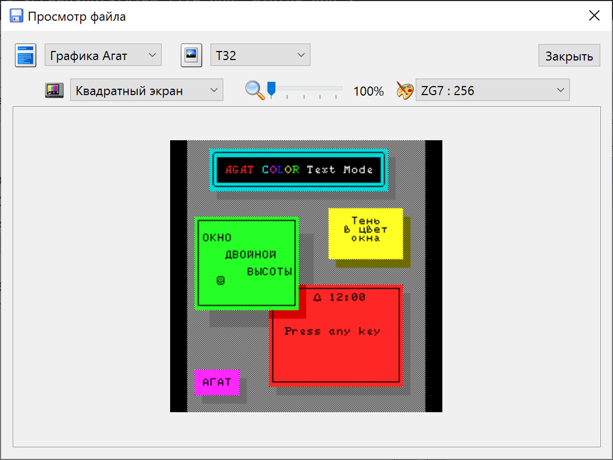
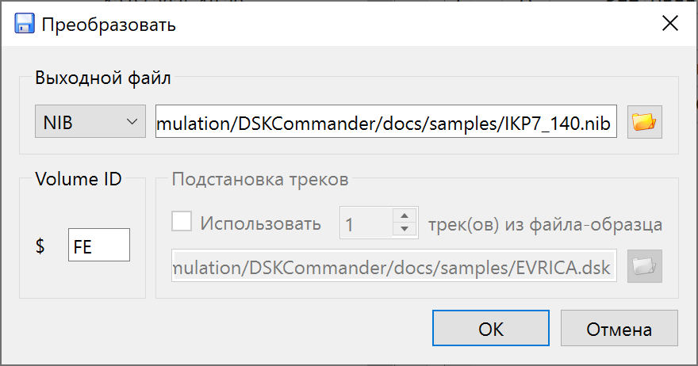

# Руководство пользователя

## Главное окно

Версия 2.x.x представляет собой двухпанельный файловый менеджер в стиле Norton Commander. Левая и правая панели являются равноценными и позволяют одновременно просматривать содержимое диска и файловую систему компьютера, или два разных диска.

**Основные возможности:**
- **Двухпанельный интерфейс** &ndash; каждая панель может независимо работать с образом диска или директорией на компьютере.
- **Групповые файловые операции** &ndash; копирование, перемещение и удаление файлов между панелями.
- **Рекурсивные операции** &ndash; копирование и удаление полных директорий со всем содержимым.
- **Независимая история навигации** &ndash; каждая панель запоминает свою историю переходов.
- **Проверка несохранённых изменений** &ndash; программа предупредит перед закрытием, если образ был изменён но не сохранён.
- **Корзина для файлов** &ndash; файлы на компьютере перемещаются в корзину вместо окончательного удаления.

Чтобы программа могла правильно обработать образы дисков, необходимо правильно установить их параметры. Во многих случаях это можно сделать автоматически, отметив опцию &laquo;Авто&raquo;, но в случае, когда автоопределение не сработало, отметку можно снять и попробовать задать значения вручную. 

## Основные операции

### Панели (Левая и Правая &ndash; равноценные)

Обе панели имеют одинаковый функционал.

### Клавиатурные сокращения

Программа использует классическую раскладку клавиш файловых менеджеров:

* **Insert** &ndash; выделить/снять выделение текущего файла и перейти к следующему;
* **Стрелки вверх/вниз** &ndash; перемещение курсора без изменения выделения;
* **Backspace** &ndash; перейти вверх на один уровень;
* **Enter** &ndash; открыть файл или директорию;
* **+** (Plus) &ndash; выделить все файлы;
* **-** (Minus) &ndash; снять выделение со всех файлов;
* __*__ (Asterisk) &ndash; инвертировать выделение;
* **Tab** &ndash; переключиться на другую панель;
* **F1** &ndash; вызов окна &laquo;О программе&raquo;;
* **F2** &ndash; сохранить изменённый образ (для DSK);
* **Ctrl-F2** &ndash; экспортировать образ в другой формат;
* **F3** &ndash; просмотр файла;
* **Ctrl-F3** &ndash; просмотр информации о файле внутри образа;
* **F4** &ndash; открыть образ/редактировать метаданные;
* **F5** &ndash; копирование файлов;
* **F6** &ndash; переименование файла;
* **F7** &ndash; создание директории;
* **F8** &ndash; удаление файлов и директорий;
* **F9** &ndash; восстановление удалённых файлов и директорий;
* **F10** &ndash; выход из программы.

## Работа с двумя панелями

### Навигация в панелях
*  &ndash; перейти вверх на один уровень;
*  &ndash; выбрать директорию;

### Просмотр файла:

В окне просмотра файла выбирается формат (Текст/двоичный/Бейсик и т.д.). Для текстовых форматов также выбирается кодировка, для графических &ndash; дополнительные параметры.

#### Просмотр графических образов экранов Агат

Для выбора доступны: соотношение сторон, масштаб и палитра. Если в файле присутствует заполненный [VR-блок](https://agatcomp.ru/agat/PCutils/EXIF.shtml), тип изображения и палитра будут выбраны автоматически. 

#### Просмотр текстовых образов экранов Агат

Для текстовых форматов доступен выбор типа знакогенератора. Если в файле присутствует заполненный [VR-блок](https://agatcomp.ru/agat/PCutils/EXIF.shtml), знакогенератор будет выбран автоматически.

Для загружаемых знакогенераторов: знакогенератор в формате ZG7 или ZG9 должен лежать вместе с просматриваемым файлом на образе диска или рядом с образом в файловой системе ОС компьютера в формате FIL. Файл FIL должен называться одинаково с именем загружаемого знакогенератора (&laquo;GARNIZON.fil&raquo;). Внутри FIL должен лежать файл с префиксом типа: &laquo;ZG9_GARNIZON&raquo;. 

### Экспорт диска:

При экспорте диска, в зависимости от выбранного формата, доступны следующие операции:

* Замена первых дорожек на дорожки из файла-образца. Пока доступно только для формата DSK.
* Указание метки тома. Доступно для физических форматов. Обратите внимание, что метка тома, указанная в файловой системе (можно посмотреть в окне информации), в общем случае должна совпадать со значением, записанным в заголовках секторов.

### Редактирование метаданных.

Набор доступных полей для редактирования зависит от файловой системы конкретного диска. На скриншоте выше показаны значения, характерные для Apple DOS 3.3.

С помощью переключателя вверху окна можно изменять формат вводимых числовых данных &ndash; десятичный/шестнадцатеричный.

