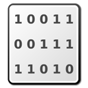

# Руководство пользователя

## Главное окно

Версия 2.0.0 представляет собой двухпанельный файловый менеджер в стиле Norton Commander. Левая и правая панели являются равноценными и позволяют одновременно просматривать содержимое диска и хост-файловую систему, или два разных диска.

**Основные возможности:**
- **Двухпанельный интерфейс** &ndash; каждая панель может независимо работать с образом диска или папкой в хост-системе.
- **Групповые файловые операции** &ndash; копирование, перемещение и удаление файлов между панелями.
- **Рекурсивные операции** &ndash; копирование и удаление полных директорий со всем содержимым.
- **Независимая история навигации** &ndash; каждая панель запоминает свою историю переходов.
- **Проверка несохранённых изменений** &ndash; программа предупредит перед закрытием, если образ был изменён но не сохранён.
- **Корзина для файлов** &ndash; файлы на хост-системе перемещаются в корзину вместо окончательного удаления.

Чтобы программа могла правильно обработать образы дисков, необходимо правильно установить их параметры. Во многих случаях это можно сделать автоматически, отметив опцию &laquo;Авто&raquo;, но в случае, когда автоопределение не сработало, отметку можно снять и попробовать задать значения вручную. 

## Основные операции

### Панели (Левая и Правая &ndash; равноценные):

Обе панели имеют одинаковый функционал. Для удобства каждая панель может иметь собственный набор кнопок.

* **Навигация**
    *  &ndash; перейти вверх на один уровень;
    *  &ndash; открыть директорию;
    *  &ndash; открыть образ диска. Двойной клик по файлу образа также открывает его.
    * &laquo;Авто&raquo; &ndash; при открытии образа программа попытается определить параметры автоматически.

* **Просмотр и анализ**
    *  &ndash; информация о выбранном файле;
    *  &ndash; просмотр файла. Двойной клик также открывает просмотр.;
    *  &ndash; анализ (определение типа) выбранного файла.

* **Список файлов**
    *  &ndash; включение/отключение алфавитной сортировки списка файлов;
    *  &ndash; включение/отключение отображения удаленных файлов.

* **Редактирование (работает в зависимости от файловой системы)**
    *  &ndash; создание директории;
    *  &ndash; переименование файла, редактирование атрибутов и метаданных;
    *  &ndash; добавление новых файлов с хост-системы. Можно выделить несколько файлов.
    *  &ndash; сохранить файл(ы) на диск хост-системы.
    *  &ndash; удаление файлов и директорий. Удалять можно несколько файлов одновременно. Файлы на хост-системе перемещаются в корзину.

* **Экспорт**
    *  &ndash; экспорт диска целиком в другой формат.

### Клавиатурные сокращения для выделения файлов:

Программа использует классическую раскладку клавиш файловых менеджеров:

* **Insert** &ndash; выделить/снять выделение текущего файла и перейти к следующему;
* **Стрелки вверх/вниз** &ndash; перемещение курсора без изменения выделения;
* **Backspace** &ndash; перейти вверх на один уровень;
* **Enter** &ndash; открыть файл или директорию;
* **+** (Plus) &ndash; выделить все файлы;
* **-** (Minus) &ndash; снять выделение со всех файлов;
* **\*** (Asterisk) &ndash; инвертировать выделение;
* **Tab** &ndash; переключиться на другую панель;
* **F3** &ndash; просмотр файла;
* **F4** &ndash; редактирование метаданных;
* **F5** &ndash; копирование файлов;
* **F6** &ndash; перемещение/переименование файлов;
* **F7** &ndash; создание директории;
* **F8** &ndash; удаление файлов.

### Просмотр файла:

В окне просмотра файла выбирается формат (Текст/двоичный/Бейсик и т.д.). Для текстовых форматов также выбирается кодировка, для графических &ndash; дополнительные параметры.

#### Просмотр графических образов экранов Агат:

Для выбора доступны: соотношение сторон, масштаб и палитра. Если в файле присутствует заполненный [VR-блок](https://agatcomp.ru/agat/PCutils/EXIF.shtml), тип изображения и палитра будут выбраны автоматически. 

#### Просмотр текстовых образов экранов Агат:

Для текстовых форматов доступен выбор типа знакогенератора. Если в файле присутствует заполненный [VR-блок](https://agatcomp.ru/agat/PCutils/EXIF.shtml), знакогенератор будет выбран автоматически.

Для загружаемых знакогенераторов: знакогенератор в формате ZG7 или ZG9 должен лежать вместе с просматриваемым файлом на образе диска или рядом с образом в файловой системе ОС компьютера в формате FIL. Файл FIL должен называться одинаково с именем загружаемого знакогенератора (&laquo;GARNIZON.fil&raquo;). Внутри FIL должен лежать файл с префиксом типа: &laquo;ZG9:GARNIZON&raquo;. 

### Экспорт диска:

При экспорте диска, в зависимости от выбранного формата, доступны следующие операции:

* Замена первых дорожек на дорожки из файла-образца. Пока доступно только для формата DSK.
* Указание метки тома. Доступно для физических форматов. Обратите внимание, что метка тома, указанная в файловой системе (можно посмотреть в окне информации), в общем случае должна совпадать со значением, записанным в заголовках секторов.

### Переименование файла и редактирование метаданных.

Набор доступных полей для редактирования зависит от файловой системы конкретного диска. На скриншоте выше показаны значения, характерные для Apple DOS 3.3.

С помощью переключателя вверху окна можно изменять формат вводимых числовых данных &ndash; десятичный/шестнадцатеричный.

## Работа с двумя панелями

### Групповые операции

Версия 2.0.0 предоставляет удобный интерфейс для работы между двумя панелями:

* **Копирование файлов** (F5) &ndash; скопировать выделённые файлы из активной панели в другую панель. Если обе панели содержат образы дисков, программа предложит выбрать формат целевой файловой системы.

* **Перемещение файлов** (F6) &ndash; переместить или переименовать файлы. При перемещении между разными панелями файлы копируются, а затем удаляются из исходной панели.

* **Рекурсивное копирование директорий** &ndash; при копировании директории программа рекурсивно копирует всё её содержимое, сохраняя структуру папок.

* **Рекурсивное удаление директорий** &ndash; удаление директории удаляет все файлы и подпапки внутри неё.

### Форматы файлов при копировании между дисками

Когда вы копируете файлы между двумя образами дисков с разными файловыми системами, может появиться диалог выбора формата. Он позволяет:

* Выбрать, в каком формате будут сохранены файлы в целевой файловой системе;
* Преобразовать форматы файлов, если необходимо (например, из Apple DOS в Agat DOS).

## Безопасность и резервное копирование

### Проверка несохранённых изменений

Если вы работали с образом диска (добавили, удалили или изменили файлы), но не сохранили результаты, программа предупредит вас перед закрытием:

* Выберите **Экспорт** для сохранения диска;
* Выберите **Закрыть без сохранения**, если хотите отменить все изменения.

### Корзина для файлов на хост-системе

При удалении файлов с компьютера (из левой/правой панели при просмотре хост-системы) файлы перемещаются в корзину (Recycle Bin на Windows, Trash на macOS/Linux) вместо окончательного удаления. Это позволяет восстановить файлы при случайном удалении.

**Примечание:** Файлы, удалённые с образа диска, удаляются окончательно (в соответствии с файловой системой диска).