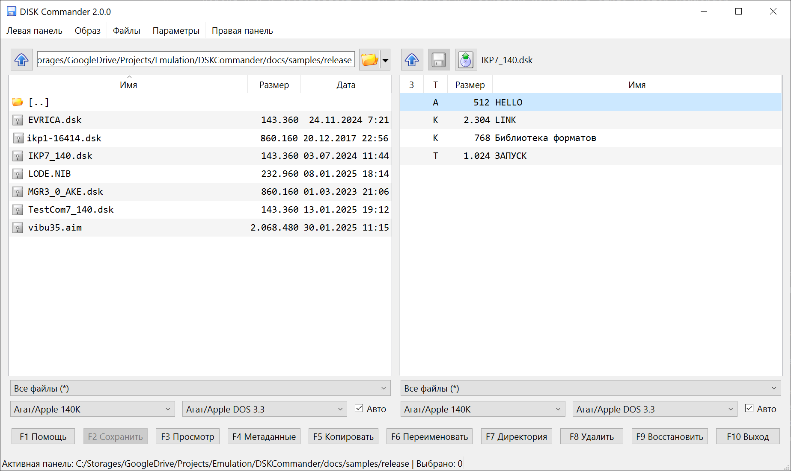

# DISK Commander

 

DISK Commander &ndash; программа для просмотра, редактирования, анализа и конвертации файлов образов дискет ретро-компьютеров.

* [Скачать последнюю версию](https://github.com/Ptr314/dsk_commander/releases)
* [Руководство пользователя](MANUAL.md)
* [Группа в Телеграме](https://t.me/ecat_emu)
* [Emuverse.ru](https://emuverse.ru) &ndash; энциклопедия эмуляции на русском языке.

На данный момент поддерживается просмотр дисков следующих форматов:
* Агат / Apple II 140 Кб, (DSK, NIC, MFM, NIB).
* Агат 840 Кб (DSK, AIM, HFE, NIB).
* Агат 880 Кб, ОС Nippel (DSK, AIM, HFE).
* Apple II 3,5" 800 Кб ProDOS (PO, DSK).
* Ириша 
  * 360 Кб (DSK, [IMD](http://dunfield.classiccmp.org/img/), с чередованием дорожек и без).
  * 256 Кб 8&quot; ГМД-7012 (GMD, с чередованием секторов через 6)
* Корвет, Орион-128, ПК8000 («Сура», «Веста» и т. д.), Вектор-06Ц (KDI, ODI, FDD)
* IBM PC (DSK, IMG) 360-720 Кб, 1,2-1,44 Мб.
* Atari ST (DSK, ST) 360-820 Кб, 1,44 Мб.

Редактирование образов на уровне файлов поддерживается для дисков Apple DOS 3.3 и CP/M 2.2.

Файловые системы:

* DOS 3.3 / Агат:
    * Экспорт отдельных файлов с диска в двоичный формат и формат [.FIL](http://agatcomp.ru/agat/PCutils/FileType/FIL.shtml).
    * Добавление/удаление файлов из форматов .FIL и двоичного, добавление/удаление директорий.
    * Редактирование атрибутов файлов.
* ОС &laquo;Спрайт&raquo;:
    * Экспорт в двоичный формат.
* ProDOS (ОС Nippel для Агата, Apple II):
    * Просмотр каталогов и подкаталогов.
    * Файлы с ветвями (extended) GS/OS &mdash; экспортируется ветвь данных.
    * Экспорт в двоичный формат.
* CP/M (с чередованием секторов DOS 3.3, ProDOS, без чередования):
    * Экспорт в двоичный формат.
    * Анализ повреждённых файлов для образов IMD.
* MS-DOS/Atari ST (FAT+LFN)

Просмотр файлов на дисках:
* Шестнадцатеричный дамп (обычный и для исполняемых файлов Агата).
* Текст с переключением кодировок Агат, Apple, ASCII, КОИ-7, КОИ-8 и др.
* Бейсик (Агат / Apple / CP/M MBASIC / Вектор-06Ц).
* Образы экранов графических и текстовых режимов Агат, Вектор-06Ц, файлов знакогенераторов.

Просмотр образов по секторам в шестнадцатеричном виде:
* С отметкой &laquo;плохих&raquo; секторов и цветовой раскраской по назначению.
* Перенумерация секторов в физическом и логическом порядке.
  
Импорт/экспорт файлов-образов:
* DSK (посекторные образы)
    * 140, 840 и 880К 
* DO, PO, CPM (посекторные образы для Apple CP/M)
    * 140К 
* KDI, ODI (посекторные образы Корвет и Орион-128)
  * 800К
* HFE (физический формат для [эмулятора Готек](https://www.gotekemulator.com/))
    * 840 и 880К 
* NIC (физический формат для [&laquo;японского&raquo; эмулятора](https://tulip-house.ddo.jp/digital/SDISK2/english.html))
    * 140К 
* [AIM](http://agatcomp.ru/agat/PCutils/FileType/AIM.shtml) (физический формат дисков 840К для Агата)
    * 840 и 880К 
* MFM, NIB (физический формат)
    * 140К
    * 840K

Благодарности:

* David Vignoni за коллекцию иконок [Nuvola](https://commons.wikimedia.org/wiki/Category:Nuvola_icons);
* Сообществу сайта [agatcomp.ru](http://agatcomp.ru) за помощь с информацией.