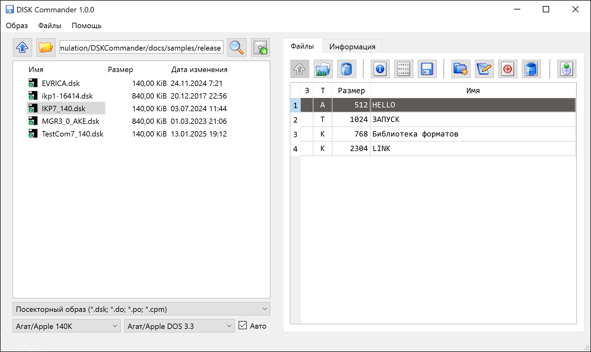

# DISK Commander

 

DISK Commander &ndash; программа для просмотра, анализа и конвертации файлов образов дискет ретро-компьютеров.

* [Скачать последнюю версию](https://github.com/Ptr314/dsk_commander/releases)
* [Руководство пользователя](MANUAL.md)
* [Группа в Телеграме](https://t.me/ecat_emu)
* [Emuverse.ru](https://emuverse.ru) &ndash; энциклопедия эмуляции на русском языке.

На данный момент поддерживается просмотр дисков следующих форматов:
* Агат / Apple II 140К (DSK, NIC, MFM, NIB).
* Агат 840К (DSK, AIM, HFE)

Файловые системы:

* DOS 3.3 / Агат:
    * Экспорт отдельных файлов с диска в двоичный формат и формат [.FIL](http://agatcomp.ru/agat/PCutils/FileType/FIL.shtml). 
* ОС &laquo;Спрайт&raquo;:
    * Экспорт в двоичный формат.
* CP/M:
    * Экспорт в двоичный формат.
  
Импорт/экспорт файлов-образов:
* DSK (посекторные образы)
    * 140 и 840К 
* HFE (физический формат для [эмулятора Готек](https://www.gotekemulator.com/))
    * 840К 
* NIC (физический формат для [&laquo;японского&raquo; эмулятора](https://tulip-house.ddo.jp/digital/SDISK2/english.html))
    * 140К 
* [AIM](http://agatcomp.ru/agat/PCutils/FileType/AIM.shtml) (физический формат дисков 840К для Агата)
    * 840К 
* MFM, NIB (физический формат)
    * 140К 

Благодарности:

* David Vignoni за коллекцию иконок [Nuvola](https://commons.wikimedia.org/wiki/Category:Nuvola_icons);
* Сообществу сайта [agatcomp.ru](http://agatcomp.ru) за помощь с информацией.